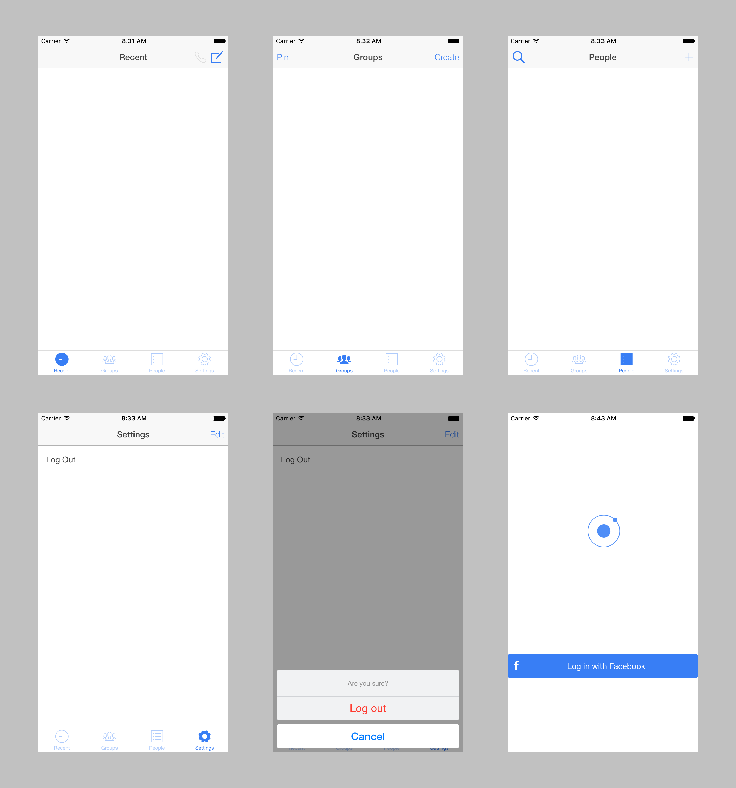

# Ionic Messenger

http://market.ionic.io/starters/ionic-messenger

#### Demo

1. Ionic View –&nbsp; `{appId: "7728863d"}`
2. Browser – https://ionic-messenger.firebaseapp.com 

## Getting Started

Download [ionic-messenger.zip](https://s3.amazonaws.com/ionic-marketplace/ionic-messenger/145177141091900/ionic-messenger.zip) and extract the project files

or clone the repository from GitHub:

    git clone https://github.com/sbolel/ionic-messenger

or if you're feeling generous, purchase it from Ionic Market :D

#### Notes

The Bower installation directory is set to `./bower_components` in [.bowerrc](https://github.com/sbolel/ionic-messenger/blob/master/.bowerrc) (as opposed to the standard `./www/lib`). [`gulpfile.js`](https://github.com/sbolel/ionic-messenger/blob/master/gulpfile.js) implements copying of dependencies to /www/lib.

## Backlog

* I can login with my Facebook account  _(Firebase auth)_
* I can see, send, receive, and edit messages in realtime _(Firebase backend)_ 
* I can send and receive pictures in messages _(base64 in Firebase or AWS S3)_

## Screenshots

